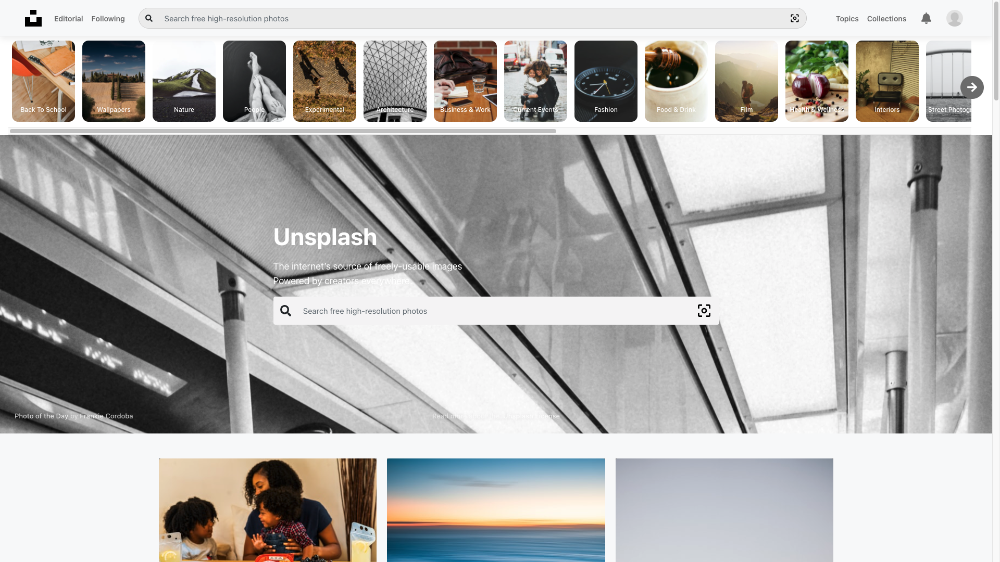
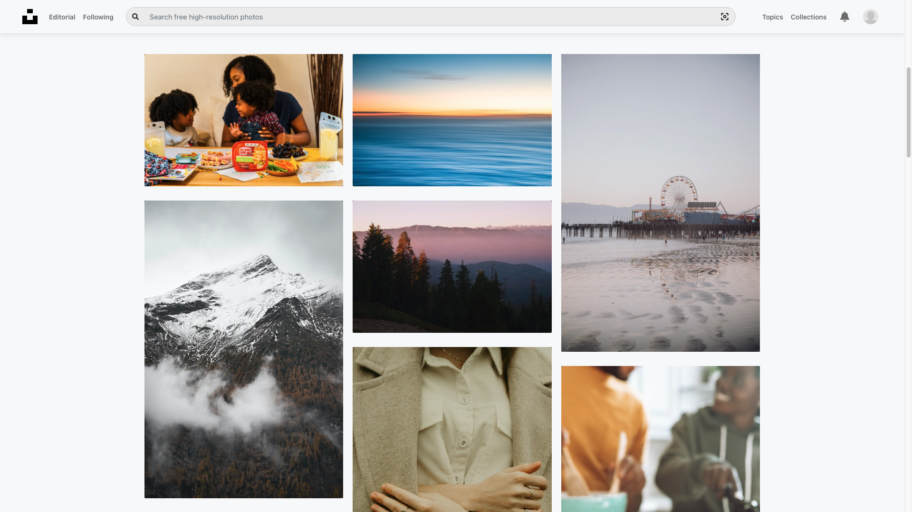
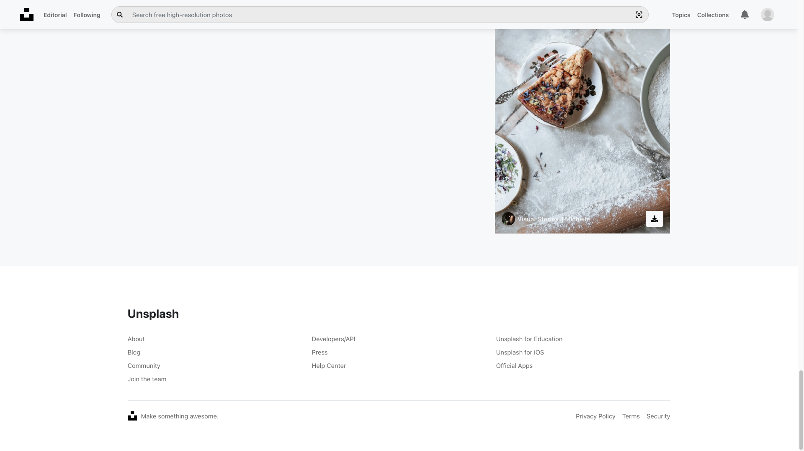

### Would you like to support me?

<a href="https://www.buymeacoffee.com/jbagaresgaray" target="_blank"></a>

# Unsplash App built with React JS and Redux

A Unsplash app build with React JS and Redux

## Screenshots

[](https://react-unsplash-clone.web.app)
[](https://react-unsplash-clone.web.app)
[](https://react-unsplash-clone.web.app)

## Plugins Used

- React JS,
- Redux,
- Redux-Thunk,
- Redux Toolkit,

## Source URL

- GitHub: https://github.com/jbagaresgaray/React-Unsplash-App-Clone

## Demo URL

- https://react-unsplash-clone.web.app

[](https://react-unsplash-clone.web.app)

## Environment Variables

```
REACT_UNSPLASH_ACCESS_KEY=
REACT_UNSPLASH_SECRET_KEY=
REACT_API_URL=https://api.unsplash.com/
```

## Ionic React Version

Wanne see the Ionic React version of this app? See the link below:

- GitHub: https://github.com/jbagaresgaray/Ionic-React-Unsplash-App

## React Native Version

Wanne see the React Native version of this app? See the link below:

- GitHub: https://github.com/jbagaresgaray/React-Native-Unsplash-App

## You can find me on:

- Github: http://github.com/jbagaresgaray
- Twitter: http://twitter.com/Janphil17
- Website: https://jbagaresgaray.github.io/

Wanna give me a coffee?

- Paypal: philipgaray2@gmail.com

<a href="https://www.buymeacoffee.com/jbagaresgaray" target="_blank"></a>
